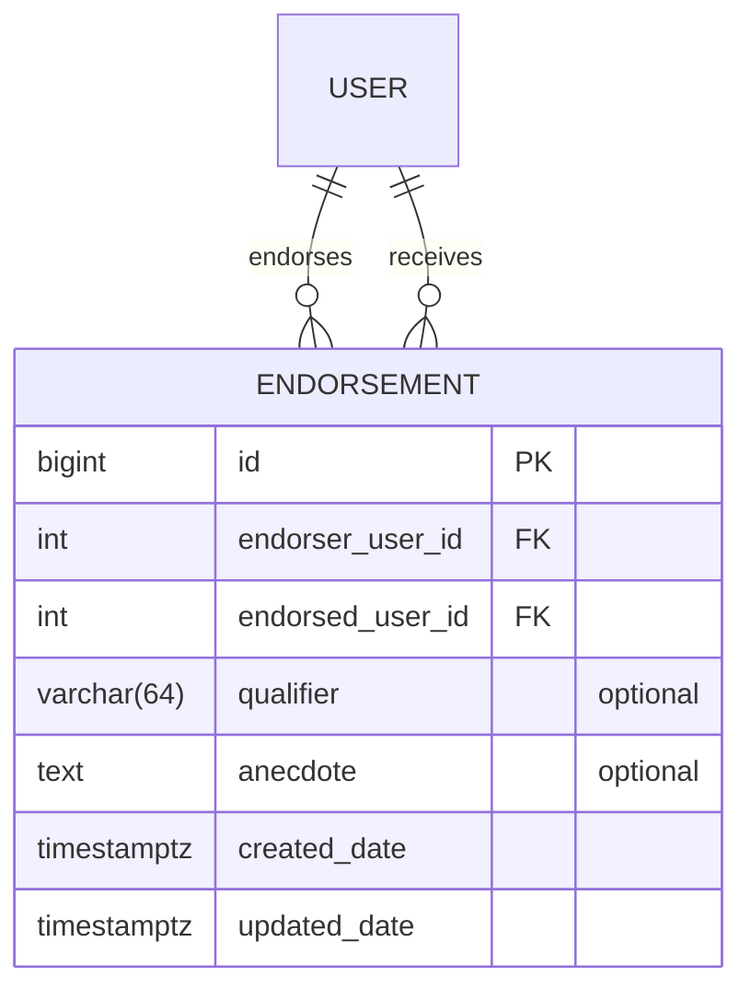

# Endorsements

## API Endpoints
The endorsements view extends _ModelViewSet_, so it is pretty straightforward for the most part:

- `GET /api/endorsements/` - list endorsements;
- `GET /api/endorsements/{id}` - get a single endorsement by ID;
- `POST /api/endorsements/` - create an endorsement;
- `PATCH /api/endorsements/{id}` - update an endorsement by ID;
- `DELETE /api/endorsements/{id}` - delete an endorsement by ID.

Most responses return the following JSON representing the endorsement:
```json
{
  "id": 937,
  "endorser_user": 2,
  "endorsed_user": 301,
  "is_reciprocal": true,
  "qualifier": "",
  "anecdote": "",
  "endorser_in_degree": 4,
  "created_date": "2026-02-16T15:24:56.121312Z",
  "updated_date": "2026-02-16T15:24:56.121337Z",
  "endorser_author": {
      "id": 565,
      "first_name": "John",
      "last_name": "Doe",
      "profile_image": null
  }
}
```

Pagination follows Django _PageNumberPagination_: 
```json
  {
    "count": 0,
    "next": null,
    "previous": null,
    "results": []
  }
```

The only differences worth mentioning are:
- _PUT_ is not supported as it doesn't make sense for an endorsement to be replaced, so it can only be updated via 
  _PATCH_ or _DELETE_;
- _POST_, _PATCH_ and _DELETE_ require authentication and ownership of the resource;
- The _list_ endpoint requires at least one of _endorser_user_id_ or _endorsed_user_id_ to be provided, otherwise it 
  will return a 400 validation error;
- The `endorser_author` attribute is only returned in the response if query parameter `include_endorser_author=true`;
- The `qualifier` and `anectode` attributes are optional and can be empty;
- The _create_ endpoint returns 409 Conflict if the user already endorses the other user;
- The _delete_ endpoint returns no content.

### Caching
The _list_ endpoint is cached for 5 minutes with first-page-only caching.

Because the GET endpoints are public, I've decided to not use any user-specific caching so that the cache can be 
shared across users. Because of that, any time an endorsement is created, updated, or deleted, the cache is 
invalidated. We will have way more reads than writes, so this should be fine and be much simpler to implement and 
reason about.

### Throttling
The _create_ endpoint is throttled at 3 requests / min / user for burst and 30 requests / day / user for sustained use.

## Data Model



### Constraints
Created some constraints to prevent invalid data at the database level:
- block self-endorsement: `CHECK (endorser_user_id <> endorsed_user_id)`;
- ensure unique endorser, endorsed pair: `UNIQUE (endorser_user_id, endorsed_user_id)`;

### Indexes
Created databases indexes for our main use cases:
- endorsements given by a user, ordered by created date desc: `(endorsed_user_id ASC, created_date DESC)`;
- endorsements received by a user, ordered by created_date desc: `(endorser_user_id ASC, created_date DESC)`;

## Technical decisions
- Initially created endorsement code inside the `user` app, but moved it into its own app to avoid bloating `user`.
- Considered using UUIDs for endorsements but decided to follow the pattern of the other entities in the codebase.
- Considered setting `db_table` to `endorsement`, but decided to follow the pattern of the other entities in the codebase.
- Fixed ordering to `-created_date` because it matches the current use case and avoids creating too many indexes.
- Enforced `endorser_user` or `endorsed_user` as required list query parameters because this matches our use cases, aligns with the indexes, prevents querying the entire table, and simplifies caching.
- Considered creating an `EndorsementQualifier` model, but decided to keep it simple using a `CharField` with `TextChoices`. We can migrate to a separate model later without losing data.
- Considered always including `endorser_author` in responses to simplify code, but decided to keep it optional for flexibility.
- Implemented caching for the endorsements list endpoint with a 5-minute TTL and first-page-only caching. The cache key is based on a prefix and normalized query parameters.
- Considered model signals (`post_save`/`post_delete`) for cache invalidation, but kept invalidation in the API write path for the first version to keep behavior simple and explicit. Signals would also not fully guarantee invalidation for all writing paths (for example, bulk operations or raw SQL).
- Added type hints and `@override` annotations, following patterns in newer code.
- Added create-only per-user throttling with burst and daily limits to reduce spam while keeping reads unrestricted.
- Added serializer-level `AlreadyEndorsedConflict` (`409`) and reused it in `perform_create` so duplicate endorsement errors are consistent across pre-save validation and DB race-condition (`IntegrityError`) paths.
- Considered deleting `ENDORSEMENT_RECEIVED` notifications when an endorsement is removed, and it likely makes sense 
  for data hygiene; deferred for now because I could not find existing production patterns in the codebase for deleting notifications tied to deleted items.

